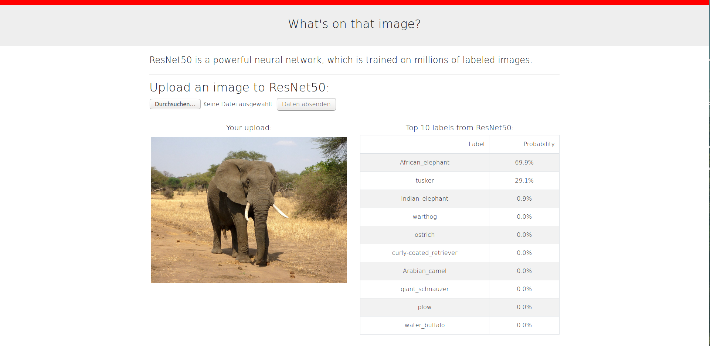

# what's on that image?

A very simple Flask web app which lets you try the labeling skills of ResNet50 in a browser.

## environment

* In a python3.7 (virtual) environment: `pip install -r requirements.txt`

## use the app

* Start the webserver via `python app.py`
* In a browser, visit http://0.0.0.0:5000/whatsonthatimage
* A working internet connection is necessary for css etc.
* And this is what the app looks like in a browser. After uploading an image, ResNet50 predicts the labels with probabilities.

* Credit of the elephant pic goes to https://pxhere.com/en/photo/1126058
